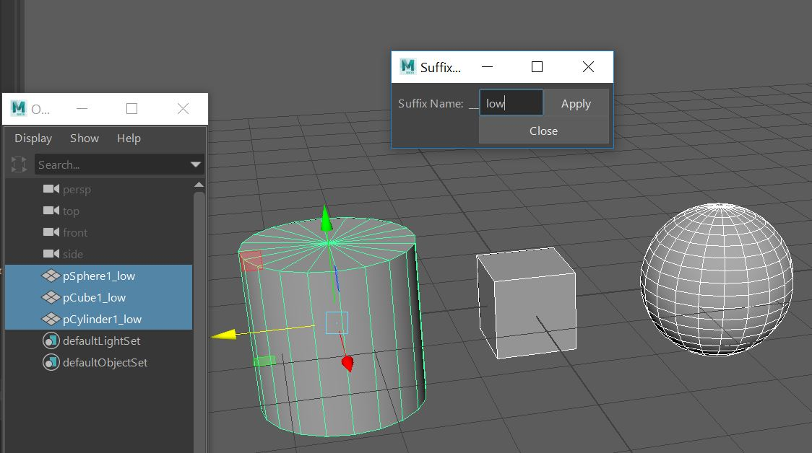

# Maya-Suffix-Renamer
This utility lets you add any suffix of choice to selected objects. This was built to quickly prep for low and high baking in Substance but can be used for any purpose.

Install Instructions:
1. *Windows- Place script file in: C:\Users\NAME\Documents\maya\2019\scripts

2. copy paste into python console -
  1. import suffixNamer
  2. reload(suffixNamer)
  3. suffixNamer.Suffix().show()

3. Highlight, then middle mouse drag code to shelf

